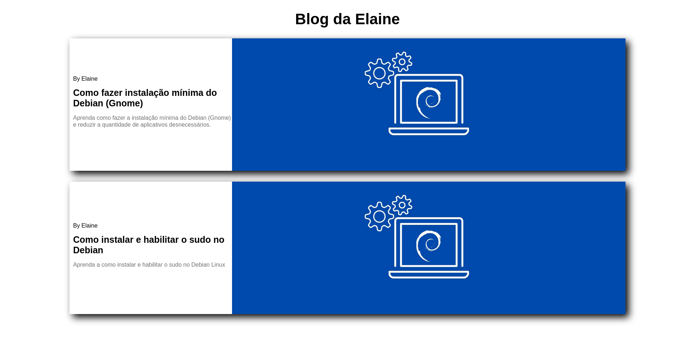

<h1 align="center">Web Components</h1>

<h2 align="center">
</a>
</h2>

  
  
  

<h2 align="center">
  <a href="https://elainefs.github.io/santander-bootcamp-2023/componentes-js-vanilla" target="_blank">Ver Projeto</a>
</h2>

## 📘 Sobre
Projeto com o objetivo de ensinar a como criar Web Componentes usando o HTML, CSS e Javascript Vanilla.

A ideia é reproduzir o que é feito com os frameworks Angular, React e outros, usando Shadow DOM, uma sub árvore criada na memória dentro de um nódulo da DOM.

## ⚒️ Tecnologias
- HTML5
- CSS3
- JavaScript

## 📄 Licença
Este projeto está sob a licença do MIT. Consulte o arquivo [LICENSE](/LICENSE) para obter mais detalhes.

Made with ❤️ by [Elaine Ferreira](https://github.com/elainefs)
