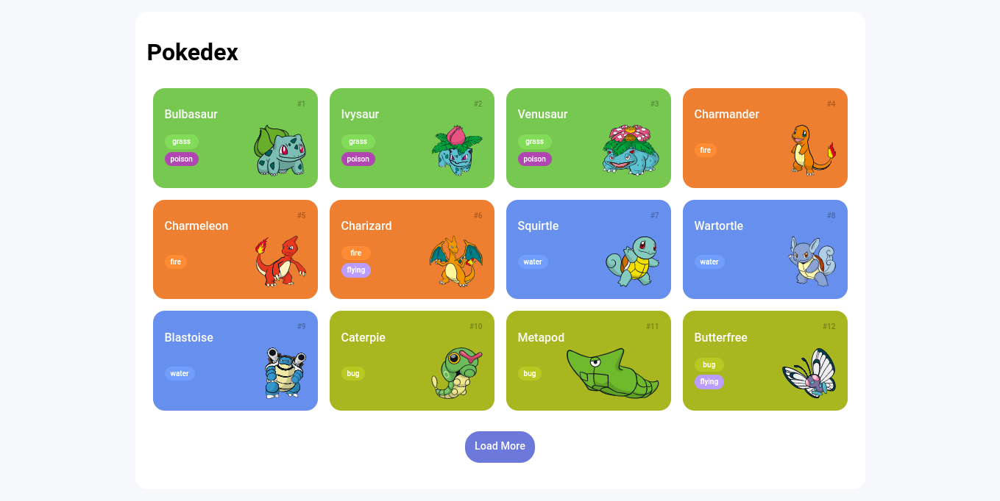

<h1 align="center">Pokedex</h1>

<h2 align="center">
</a>
</h2>

  
  
  

<h2 align="center">
  <a href="https://elainefs.github.io/santander-bootcamp-2023/pokedex" target="_blank">Ver Projeto</a>
</h2>

## 📘 Sobre
Pokedex é um projeto que consome a API PokeAPI e mostra os Pokemons e suas informações.

## ⚒️ Tecnologias
- HTML5
- CSS3
- JavaScript
- PokéAPI

## 📄 Licença
Este projeto está sob a licença do MIT. Consulte o arquivo [LICENSE](/LICENSE) para obter mais detalhes.

Made with ❤️ by [Elaine Ferreira](https://github.com/elainefs)
