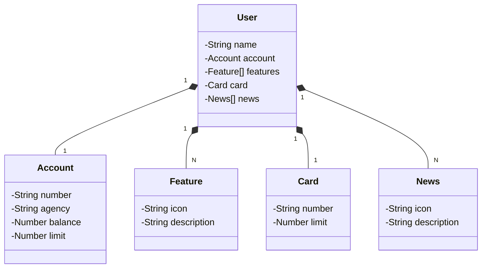

  <h1> RESTful API Bancária</h1>
  
  
  
  

## 📘 Sobre
RESTful API Bancária do Santander.

## 💻 Tecnologias
- Java 17 (OpenJDK 17)
- Spring Boot 3
- Spring Data JPA
- Swagger
- H2 Database Engine
- PostgreSQL
- Railway
- Figma

## [Link do Figma](https://www.figma.com/file/0ZsjwjsYlYd3timxqMWlbj/SANTANDER---Projeto-Web%2FMobile?type=design&node-id=1421%3A432&mode=design&t=6dPQuerScEQH0zAn-1)

O Figma foi utilizado para a abstração do domínio desta API, sendo útil na análise e projeto da solução.

## Diagrama de Classes (Domínio da API)

## ✅ Funcionalidades
- [x] Cadastro de usuários
- [x] Atualização de informações do usuários
- [x] Deleção de usuários

### Rodar a aplicação localmente
1 - Clonar o repositório `git clone https://github.com/elainefs/santander-bootcamp-2023.git`

2 - Entrar na pasta do projeto `cd restful-api`

3 - Rodar `gradle install` para instalar as dependências

4 - Rodar `gradle bootRun` para subir a aplicação

5 - A aplicação estará disponível na porta `localhost:8080`

6 - Use um Cliente de requisições HTTP para fazer os testes 

## 📄 Licença
Este projeto está sob a licença MIT. Consulte o arquivo [LICENSE](/LICENSE) para obter mais detalhes.

Made with ❤️ by [Elaine Ferreira](https://github.com/elainefs)