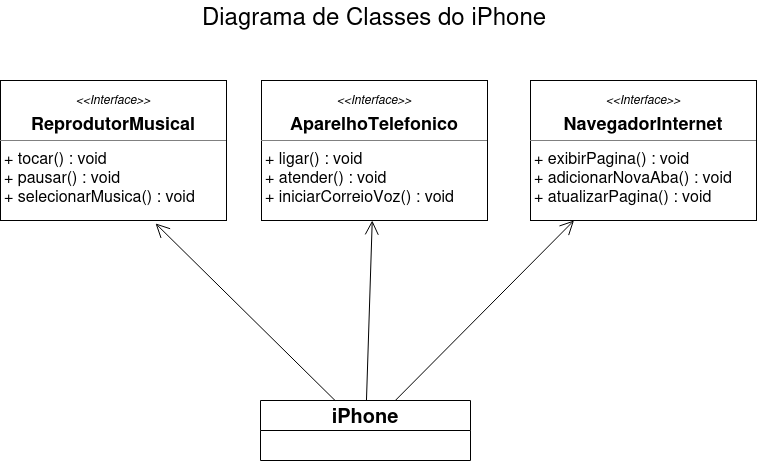

# Desafio 

Com base no [vídeo de lançamento do iPhone](https://www.youtube.com/watch?v=9ou608QQRq8), elabore em uma ferramenta de UML de sua preferência. A diagramação das classes e interfaces com a proposta de representar os papéis do iPhone de: Reprodutor Musical, Aparelho Telefônico e Navegador na Internet. Em seguida crie as classes e interfaces no formato de arquivos `.java`.

---

## Diagramação de Classes do Iphone
Diagrama de classes elaborado usando o [Drawio](https://www.drawio.com/).

## 📄 Licença
Este projeto está sob a licença do MIT. Consulte o arquivo [LICENSE](/LICENSE) para obter mais detalhes.

---

Made with ❤️ by [Elaine Ferreira](https://github.com/elainefs)